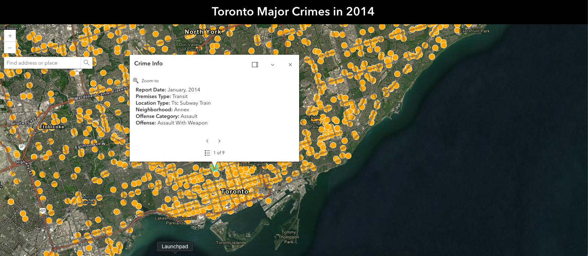

# Toronto Crime

Toronto crime is a website that shows major crime reported in 2014 (work in progress to show data till present).

## Screen Shot



## Links

- Live Site URL : [Toronto Crime]()

## Features

- Drag the map with zoom in and out functionality.
- Shows the location of the crime on the map with a location pin icon.
- Search addresses to go to the specific location easily.
- View details of the location and the crime by clicking the location pin icon.

## Tech

Toronto Crime ws created by using the libraries and datasets:

- [Vite / React](https://vitejs.dev/) - Framework for web design using javaScript.
- [ArcGIS Maps SDK for JavaScript](https://developers.arcgis.com/documentation/mapping-apis-and-services/) - ArcGis library for maps.
- [Major Crimes Dataset](https://data.torontopolice.on.ca/datasets/0a239a5563a344a3bbf8452504ed8d68_0/explore?location=43.743424%2C-79.224097%2C13.73) - Major crimes free dataset provided by Toronto Police.

## Installation

Install the dependencies and devDependencies and start the server.

```sh
npm i
npm run dev
```

## Development

Work in progress to color code different offense types and show it on the legend.
