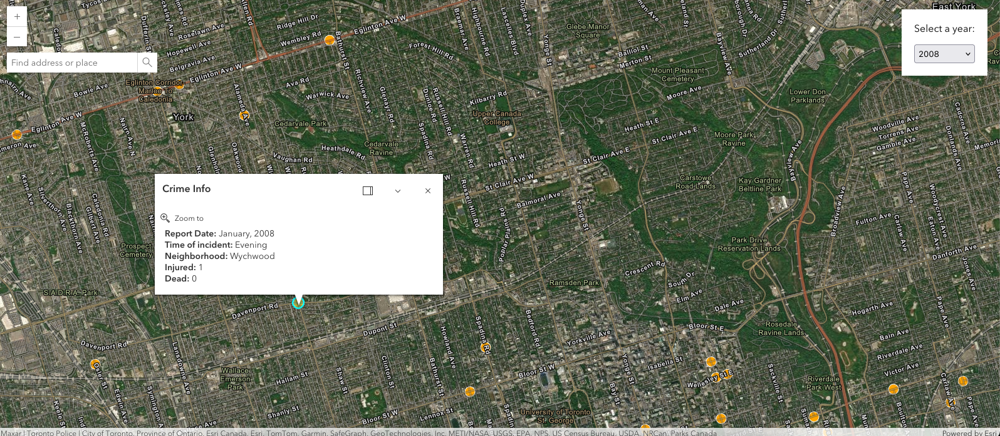

# Toronto Shootings

Toronto shootings is a website that shows shootings reported in Toronto between 2004 - 2012.

## Screen Shot



## Links

- Live Site URL : [Toronto Shootings](https://torontoshootings.vercel.app/)

## Features

- Drag the map with zoom-in and out functionality.
- Shows the location of the crime on the map with a location pin icon.
- Search addresses to go to the specific location easily.
- View the details of the location and crime by clicking the location pin icon.
- Show shootings by selected year

## Tech

Toronto Crime ws created by using the libraries and datasets:

- [Vite / React](https://vitejs.dev/) - Framework for web design using javaScript.
- [ArcGIS Maps SDK for JavaScript](https://developers.arcgis.com/documentation/mapping-apis-and-services/) - ArcGis library for maps.
- [Toronto Shootings Dataset](https://data.torontopolice.on.ca/datasets/64ddeca12da34403869968ec725e23c4_0/explore?location=17.454441%2C-39.812766%2C2.57&showTable=true) - Toronto shootings free dataset provided by Toronto Police.

## Installation

Install the dependencies and devDependencies and start the server.

```sh
npm i
npm run dev
```

## Development

Work in progress to color code different offense types and show it on the legend.
